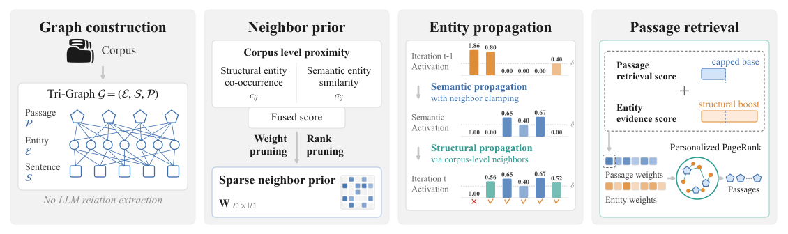
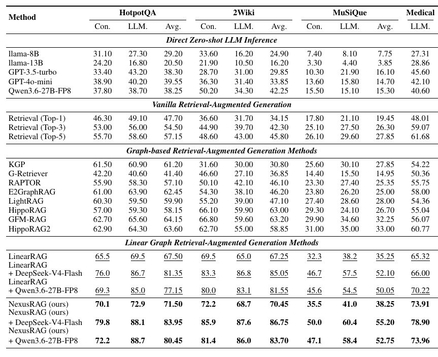
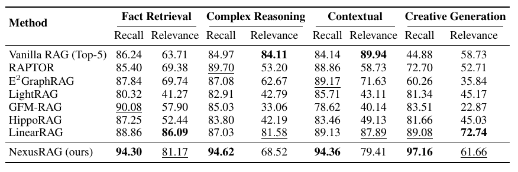

# **NexusRAG: Corpus-Guided Propagation for Graph Retrieval-Augmented Generation**

> NexusRAG builds the retrieval graph without any LLM-based relation extraction. Entity neighbors are selected by fusing co-occurrence statistics with semantic similarity, and query-relevant entities are then activated by a dual-path propagation mechanism that gates query-similar sentences with the structural prior and expands the resulting frontier along the neighbor structure.

---

## 🚀 **Highlights**

- ✅ **Dual-Path Entity Propagation: Gating and Direct Expansion**: Entity activation proceeds over two complementary paths. **The Semantic Propagation** walks from each active entity through its top-η query-similar sentences, where the neighbor clamp caps the transition by the fused neighbor weight `w_ij` and the pruning threshold δ sets the floor for non-neighbor transitions. **The Structural Propagation** then expands that query-conditioned frontier along the precomputed neighbor structure, so a structurally supported partner stays reachable even without a query-similar bridging sentence. The union of the two paths forms the next frontier, and every admitted transition accumulates into the target entity's cumulative evidence weight.
- ✅ **Corpus-Guided Propagation**: Neighbor weights are fused into a single matrix `W` controlled by `cooccur_alpha`, which balances co-occurrence evidence against semantic similarity. The cumulative evidence weights produced by dual-path propagation initialize the passage scores, which then drive Personalized PageRank down to the top-k passages.

<p align="center">
  
</p>

<p align="center">
  
</p>

<p align="center">
  
</p>

---

## 🛠️ **Usage**

### 1️⃣ Install Dependencies

**Step 1: Install Python packages**

```bash
pip install -r requirements.txt
(Use Python 3.9 preferably)
```

**Step 2: Download Spacy language model**

```bash
python -m spacy download en_core_web_trf
```

> **Note:** The `--spacy_model` argument accepts any SpaCy pipeline. For a biomedical corpus you can install and pass the scientific model instead:
```bash
pip install https://s3-us-west-2.amazonaws.com/ai2-s2-scispacy/releases/v0.5.3/en_core_sci_scibert-0.5.3.tar.gz
python run.py --dataset_name medical --spacy_model en_core_sci_scibert --cooccur_alpha 0.5
```

**Step 3: Set up your LLM service**

The QA and evaluation stages talk to any OpenAI-compatible endpoint. Point the client at your own server through environment variables, or set it per run with `--llm_base_url`:

```bash
export OPENAI_API_KEY="your-api-key-here"
export OPENAI_BASE_URL="http://localhost:8009/v1"
```

> **Note:** `OPENAI_BASE_URL` falls back to `http://localhost:8009/v1` (a local vLLM-style deployment) when it is not set, and the `Authorization` header is only attached when `OPENAI_API_KEY` is non-empty.

**Step 4: Prepare Datasets**

Place every dataset under `import/dataset/<dataset_name>/` with two files, `questions.json` and `chunks.json`:

Expected layout:

```
import/dataset/
├── 2wikimultihop/{questions.json, chunks.json}
├── hotpotqa/{questions.json, chunks.json}
├── medical/{questions.json, chunks.json}
└── musique/{questions.json, chunks.json}
```

**Step 5: Prepare Embedding Model**

The default `--embedding_model` is a path relative to the project root:

```
model/all-mpnet-base-v2/
```

`scripts/run.sh` instead points at the absolute location `/mnt/model/sentence-transformers/all-mpnet-base-v2`, so either place the model accordingly or override `EMBEDDING_MODEL` in the script.

### 2️⃣ Quick Start Example

```bash
EMBEDDING_MODEL="/mnt/model/sentence-transformers/all-mpnet-base-v2"
LLM_MODEL="gpt-4o-mini"
MAX_WORKERS=16

python run.py \
    --spacy_model "en_core_web_trf" \
    --embedding_model "${EMBEDDING_MODEL}" \
    --dataset_name "2wikimultihop" \
    --llm_model "${LLM_MODEL}" \
    --max_workers "${MAX_WORKERS}" \
    --max_iterations 3 \
    --iteration_threshold 0.4 \
    --top_k_sentence 1 \
    --top_k_entity_cooccur 5 \
    --precompute_threshold 0.5 \
    --cooccur_alpha 0.5
    # --use_vectorized_retrieval   # optional, vectorized sparse-matrix propagation instead of BFS iteration
    # --retrieval_only             # optional, run retrieval only and skip QA/evaluation
```

The command above is exactly what `scripts/run.sh` issues for one dataset. To run the full four-dataset sweep, use the script directly:

```bash
bash scripts/run.sh
```

Hyper-parameters baked into `scripts/run.sh`:

| Dataset | `--max_iterations` | `--iteration_threshold` | `--top_k_sentence` | `--precompute_threshold` | `--cooccur_alpha` |
| --- | --- | --- | --- | --- | --- |
| `2wikimultihop` | 3 | 0.4 | 1 | 0.5 | 0.5 |
| `hotpotqa` | 3 | 0.4 | 1 | 0.5 | 0.5 |
| `medical` | 3 | 0.5 | 3 | 0.5 | 0.5 |
| `musique` | 5 | 0.1 | 4 | 0.5 | 0.5 |

`--spacy_model en_core_web_trf`, `--top_k_entity_cooccur 5` and `--max_workers 16` are shared by all four runs.

> **Note:** `scripts/run.sh` assumes the project is checked out at `/mnt/NexusRAG` and that the embedding model sits at `/mnt/model/sentence-transformers/all-mpnet-base-v2`. Adjust the `cd` target and `EMBEDDING_MODEL` at the top of the script for your own machine. `LLM_MODEL` is a placeholder there, so set it to a model name actually served by your endpoint. 

Omitting `--cooccur_alpha` runs the full sweep over 21 values from 0 to 1 in steps of 0.05. A comma-separated list such as `--cooccur_alpha 0.0,0.5,1.0` runs only the given values.

---

## ⚙️ **Key Arguments**

| Argument | Default | Description |
| --- | --- | --- |
| `--dataset_name` | `novel` | Dataset folder name under `import/dataset/` |
| `--spacy_model` | `en_core_web_trf` | SpaCy pipeline used for entity recognition |
| `--embedding_model` | `model/all-mpnet-base-v2` | SentenceTransformer model path |
| `--llm_model` | `""` | QA model name; falls back to the client default |
| `--llm_base_url` | `""` | QA service URL; falls back to `OPENAI_BASE_URL` |
| `--eval_llm_model` | `""` | Dedicated evaluation model; reuses the QA model when empty |
| `--eval_llm_base_url` | `""` | Dedicated evaluation URL; reuses the QA URL when empty |
| `--cooccur_alpha` | `None` | Fuse weight between co-occurrence and similarity; sweep when unset |
| `--top_k_entity_cooccur` | `5` | Cap on co-occurring entities kept per entity when building `W` |
| `--top_k_sentence` | `3` | Top-k query-similar sentences (η) per active entity on the Sentence-Mediated Path |
| `--precompute_threshold` | `0.5` | Similarity threshold applied when precomputing the neighbor matrix |
| `--max_iterations` | `3` | Maximum number of propagation hops |
| `--iteration_threshold` | `0.4` | Pruning threshold δ; transitions below it are discarded, non-neighbor transitions are kept only at this floor |
| `--max_workers` | `16` | Worker count for QA and evaluation |
| `--use_vectorized_retrieval` | off | Use vectorized propagation instead of BFS iteration |
| `--no_resume` | off | Disable resume mode (resume is on by default) |
| `--resume_save_every` | `20` | Save `predictions.json` every N entries in resume mode |
| `--retrieval_only` | off | Run retrieval only, write `retrieval.json`, skip QA and evaluation |

---

## 🗂️ **Project Structure**

```
NexusRAG/
├── run.py                  # Entry point: alpha sweep, resume logic, result CSV and plots
├── src/
│   ├── NexusRAG.py         # Core pipeline: indexing, neighbor matrix, dual-path propagation, retrieval
│   ├── config.py           # NexusRAGConfig dataclass
│   ├── embedding_store.py  # Embedding cache and cosine-similarity lookups
│   ├── evaluate.py         # Evaluator: EM and containment accuracy
│   ├── ner.py              # SpacyNER wrapper
│   └── utils.py            # LLM_Model (OpenAI-compatible client) and logging setup
├── scripts/
│   └── run.sh              # Four-dataset sweep ready to run
├── figure/
│   └── main_figure.svg     # Framework overview
└── requirements.txt
```

---

## 📤 **Outputs**

Everything lands under a run-specific directory derived from the retrieval hyper-parameters:

```
results/alpha_sweep_s<>_k<top_k_entity_cooccur>_<llm_model>/
└── threshold_<precompute_threshold>/
    └── <dataset_name>/
        ├── alpha_sweep_results.csv      # per-alpha EM / Contain_Acc, resume source
        ├── alpha_sweep_lineplot.png     # alpha sensitivity, line plot
        ├── alpha_sweep_barplot.png      # alpha sensitivity, bar plot
        └── alpha_<alpha>_<timestamp>/   # per-alpha run
            ├── log.txt
            ├── retrieval.json
            ├── evaluation_results.json
            └── predictions.json
```

`alpha_sweep_results.csv` doubles as the resume ledger: any `cooccur_alpha` already present is skipped, and a run whose `retrieval.json` exists without a `predictions.json` is reused instead of recomputed. `--retrieval_only` writes only `retrieval.json` and leaves the CSV untouched.

---

## 📄 **License**

Released under the **GNU General Public License v3.0 (GPL-3.0)**. See [`LICENSE.txt`](LICENSE.txt) for the full text.
